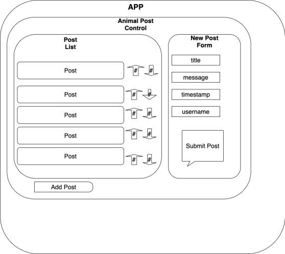

# Animal Facts Forum

## _React and Redux Practice for Epicodus, 09.15.2020_
 

### By Kate Skorija, Mariel Hamson, Evgeniya Chernaya
 

## Description

This week we learned the basics of Redux for React, focusing on planning where state lives, implementing redux with single and multiple state slices, and moving local and shared state to the Redux store. This is a forum for fun animal facts, where a user can see all animal facts posts, add a new post, upvote and downvote posts, as well as see which posts are most popular. Users can also see the posts sorted in order of popularity.

This project was bootstrapped with [Create React App](https://github.com/facebook/create-react-app).
  

## Component Diagram

  

## User Stories

*  As a user, I want to enter content into a form and submit to create a new post.
*  As a user, I want my new posts to include a timestamp. And I want to see when other listings were posted, too.
*  As a user, I want to upvote posts I particularly enjoy.
*  As a user, I want to downvote posts I don't like, or find inappropriate.
*  As a user, I'd like posts with the most upvotes to appear higher on the page
  

## Known Bugs

There are no known bugs at this time.
  

## Support and Contact Details

If there are any issues or questions, please reach through our Github accounts: [kate-skorija](https://github.com/kate-skorija), [MarielHamson](https://github.com/MarielHamson), [janecher](https://github.com/janecher).
  

## Technologies Used

*  [Visual Studio Code](https://code.visualstudio.com/)
*  [Markdown](https://daringfireball.net/projects/markdown/)
*  [React](https://reactjs.org/)
*  [Redux](https://redux.js.org/basics/usage-with-react)
  

## Available Scripts

In the project directory, you can run:

### `npm start`

Runs the app in the development mode. 
Open [http://localhost:3000](http://localhost:3000) to view it in the browser.

The page will reload if you make edits. 
You will also see any lint errors in the console.

### `npm run build`

Builds the app for production to the `build` folder. 
It correctly bundles React in production mode and optimizes the build for the best performance.

The build is minified and the filenames include the hashes. 
Your app is ready to be deployed!

See the section about [deployment](https://facebook.github.io/create-react-app/docs/deployment) for more information.

### `npm run eject`

**Note: this is a one-way operation. Once you `eject`, you can’t go back!**

If you aren’t satisfied with the build tool and configuration choices, you can `eject` at any time. This command will remove the single build dependency from your project.

Instead, it will copy all the configuration files and the transitive dependencies (webpack, Babel, ESLint, etc) right into your project so you have full control over them. All of the commands except `eject` will still work, but they will point to the copied scripts so you can tweak them. At this point you’re on your own.

You don’t have to ever use `eject`. The curated feature set is suitable for small and middle deployments, and you shouldn’t feel obligated to use this feature. However we understand that this tool wouldn’t be useful if you couldn’t customize it when you are ready for it.

## Learn More

You can learn more in the [Create React App documentation](https://facebook.github.io/create-react-app/docs/getting-started).

To learn React, check out the [React documentation](https://reactjs.org/).

### License

*This project uses the following license: [MIT](https://opensource.org/licenses/MIT)*

Copyright (c) 2020 **_Kate Skorija, Mariel Hamson, Evgeniya Chernaya_** 